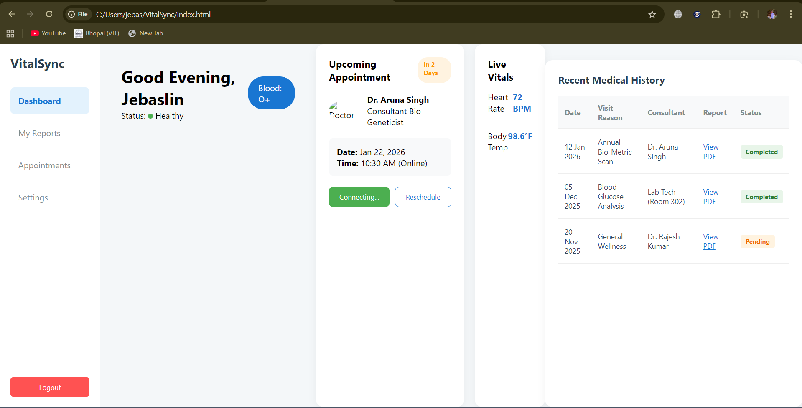

# 🏥 VitalSync - Patient-Centric Healthcare Portal

**VitalSync** is a modern, responsive frontend dashboard designed for patients to manage their medical appointments, track live vitals, and access their medical history. This project bridges the gap between clinical bio-data and user-friendly technology.

## 🚀 Live Demo
https://jebaslinhentry.github.io/VitalSync/

## ✨ Features
- **Real-time Vitals Simulation:** Uses JavaScript to simulate live heart rate (BPM) monitoring.
- **Appointment Management:** A dedicated "Hero Section" for upcoming doctor consultations.
- **Medical History Ledger:** A clean data table to track past visits and lab reports.
- **Time-Aware UI:** Dynamic greetings (Morning/Afternoon/Evening) based on user's local time.
- **Medical-Grade UI:** A clean, accessible aesthetic built with CSS Grid and Flexbox.

## 🛠️ Tech Stack
- **Structure:** HTML5
- **Styling:** CSS3 (Custom properties & Flexbox)
- **Logic:** Vanilla JavaScript
- **Icons:** Lucide / FontAwesome

## 🧬 Bio-Engineering Connection
As a Bio-Engineering student at VIT Bhopal, I developed this project to explore how **Healthcare IT** can improve patient outcomes. The portal is designed to handle biometric data (BPM, Temp) and simplify complex clinical schedules for everyday users.

## 📂 Project Structure
VitalSync/ ├── index.html # Main dashboard structure ├── style.css # Professional medical UI styling ├── script.js # Interactivity and vital simulations └── README.md # Project documentation
